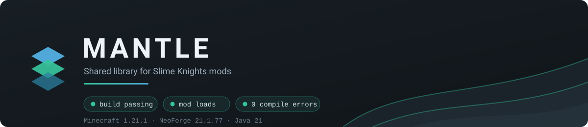
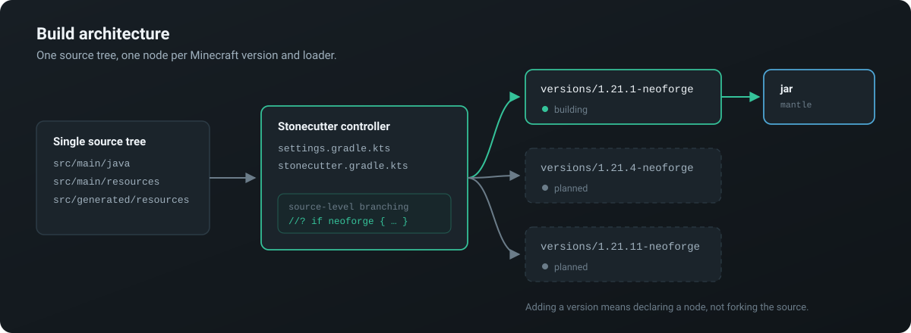

<p align="center">
  
</p>

# Mantle (Unofficial 1.21.X)

Shared code for Slime Knights mods. This is an **unofficial fork** that ports Mantle from
Minecraft 1.20.1 / Forge to **Minecraft 1.21.1 / NeoForge**. It is not affiliated with or
endorsed by Slime Knights.

> **Status: working.** The mod compiles, builds a jar, and loads — data generation runs to
> completion against NeoForge 21.1.77. See [Port status](../../wiki/Port-Status).

📖 **Wiki:** [English](../../wiki) · [Español](../../wiki/es-Inicio)

---

## What was done

Porting across the 1.20.1 → 1.21.1 boundary is not only an API migration. The bulk of the
work here fell into three areas.

### The build was rebuilt around multiple versions

The single-target Groovy build was replaced with a [Stonecutter](https://stonecutter.kikugie.dev/)
controlled layout, so one source tree can target the whole 1.21.x range. Each build target is a
node named `<mcVersion>-<loader>`, and adding a version means declaring a node rather than forking
the source.

<p align="center">
  
</p>

This forced a toolchain move: Stonecutter 0.9.8 refuses to apply on anything below **Gradle 9**,
so the wrapper moved to Gradle 9.7.1 and ModDevGradle to 2.0.147. `io.freefair.lombok` was dropped
along the way — it targets Gradle 8, and Lombok works fine wired directly.

### Three defects that "it compiles" was hiding

The tree compiled before this work, and would still not have run:

1. **The mod would never have loaded.** It still shipped the Forge 1.20.1
   `META-INF/mods.toml`. NeoForge 1.21 reads `META-INF/neoforge.mods.toml`, and the build's
   `processResources` looked for that name — which did not exist — so the `${loader_range}` and
   `${forge_range}` placeholders were never expanded.
2. **`loaderVersion` pointed at the wrong thing.** It is the version of the `javafml` language
   provider (4.x), not the NeoForge version. Loading failed with *"needs language provider
   javafml:21.1.77 or above to load, we have found 4.0.31"*. Only a real load test surfaced this.
3. **The access transformer was neither applied nor valid.** It was never registered in the
   `neoForge` block, and all 60 of its entries used SRG names (`f_97726_`, `m_280092_`) that
   1.20.2+ no longer resolves. They were removed rather than remapped, since the ported sources
   compile with only the nine `FlowingFluid` entries that were already in Mojang names.
   `validateAccessTransformers` is now **on**, so the file is checked against Minecraft on every
   build and cannot silently rot again.

### NeoForge only

MinecraftForge was evaluated and dropped, for a concrete reason: ForgeGradle 6.0.54 — the only
route to Forge on 1.21.x — refuses Gradle 9 (*"Versions Gradle 9.0 and newer are not supported
yet"*), and Stonecutter requires it. The two cannot share a Gradle build. Supporting Forge would
mean a second, parallel build on its own wrapper. See
[Build architecture](../../wiki/Build-Architecture) for the details.

---

## Building

Requires **JDK 21**. Git must be installed and on the system path.

```bash
./gradlew :1.21.1-neoforge:build     # compile and package
./gradlew :1.21.1-neoforge:runClient # launch the client
./gradlew :1.21.1-neoforge:runData   # run data generation
```

The jar lands in `versions/1.21.1-neoforge/build/libs/`. Full instructions, including how to add a
new Minecraft version, are in [Build and run](../../wiki/Build-and-Run).

If you hit obscure Gradle problems, `./gradlew clean` is the usual first move.

---

## Issue reporting

Please include:

* Minecraft version and Mantle version
* NeoForge version/build
* Versions of Mantle-dependent mods and anything else related
* Relevant screenshots
* For crashes: steps to reproduce, and `latest.log` / `debug.log` from the client's `logs` folder

Issues with **this fork's port** belong here. Issues with Mantle's actual behaviour on supported
versions belong [upstream](https://github.com/SlimeKnights/Mantle).

---

## License

The MIT License (MIT)
Copyright (c) 2013-2022 Slime Knights (mDiyo, fuj1n, Sunstrike, progwml6, pillbox, alexbegt, KnightMiner)

Permission is hereby granted, free of charge, to any person obtaining a copy of this software and associated documentation files (the "Software"), to deal in the Software without restriction, including without limitation the rights to use, copy, modify, merge, publish, distribute, sublicense, and/or sell copies of the Software, and to permit persons to whom the Software is furnished to do so, subject to the following conditions:

The above copyright notice and this permission notice shall be included in all copies or substantial portions of the Software.

THE SOFTWARE IS PROVIDED "AS IS", WITHOUT WARRANTY OF ANY KIND, EXPRESS OR IMPLIED, INCLUDING BUT NOT LIMITED TO THE WARRANTIES OF MERCHANTABILITY, FITNESS FOR A PARTICULAR PURPOSE AND NONINFRINGEMENT. IN NO EVENT SHALL THE AUTHORS OR COPYRIGHT HOLDERS BE LIABLE FOR ANY CLAIM, DAMAGES OR OTHER LIABILITY, WHETHER IN AN ACTION OF CONTRACT, TORT OR OTHERWISE, ARISING FROM, OUT OF OR IN CONNECTION WITH THE SOFTWARE OR THE USE OR OTHER DEALINGS IN THE SOFTWARE.

Any alternate licenses are noted where appropriate.
